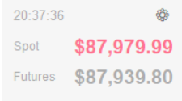

# BTC Widget for Windows

A lightweight, always-on-top cryptocurrency price monitoring widget for Windows desktop that displays real-time Bitcoin (BTC) prices from Binance.

## Features

- **Real-time Price Monitoring**: Displays both Binance spot and futures BTC/USDT prices
- **Always Visible**: Stay-on-top window with adjustable transparency (60% by default)
- **Compact Design**: Minimalist 180x100px widget that doesn't obstruct your workspace
- **Draggable**: Click and drag to position the widget anywhere on your screen
- **Price Alerts**: 
  - Set high/low price thresholds for notifications
  - Rapid price change detection (percentage-based)
  - Configurable alert cooldown to prevent notification spam
- **Proxy Support**: Built-in proxy configuration for network access
- **Clean Interface**: Shows current time and color-coded price changes (green/red)
- **No Title Bar**: Borderless design for minimal distraction

## Screenshots



The widget displays:
- Current time
- Spot price
- Futures price
- Settings button for configuration

## Requirements

- Windows OS
- Python 3.7+ (if running from source)
- Internet connection
- Optional: Proxy server (if required for Binance API access)

## Installation

### Option 1: Run from Source

1. Clone or download this repository
2. Install dependencies:
```bash
pip install -r requirements.txt
```
3. Run the widget:
```bash
python widget.py
```

### Option 2: Build Executable

Build a standalone executable using the provided batch files:

```bash
# Using PyInstaller spec file
build.bat
```

Or:

```bash
# Alternative build command
build_exe.bat
```

The executable will be created in the `dist` folder.

## Usage

### Basic Operation

- **Move Widget**: Click and drag anywhere on the widget to reposition it
- **Right-Click Menu**: Access settings and exit options
- **Settings Button**: Click the ⚙ icon to open configuration

### Configuration Options

Open settings to configure:

1. **Window Settings**
   - Toggle always-on-top behavior
   - Adjust window transparency

2. **Proxy Settings**
   - Enable/disable proxy
   - Configure proxy host and port (default: 127.0.0.1:10808)

3. **Price Alerts**
   - Enable price alerts
   - Choose alert type (spot or futures)
   - Set high/low price thresholds
   - Configure rapid price change detection (percentage-based)
   - Set alert cooldown period (default: 180 seconds)

### Price Alert System

The widget monitors price movements and can notify you when:
- Price exceeds your set high threshold
- Price drops below your set low threshold
- Price changes rapidly by a specified percentage within 3 minutes

Alert notifications appear as bubble windows near the main widget and automatically close after 10 seconds.

## Technical Details

### Dependencies

- `tkinter`: GUI framework (built-in with Python)
- `requests`: HTTP library for API calls
- `pyinstaller`: For building standalone executables

### API Endpoints

- **Binance Spot API**: `https://api.binance.com/api/v3/ticker/price`
- **Binance Futures API**: `https://fapi.binance.com/fapi/v1/ticker/price`

### Update Frequency

- Price updates: Every 1 second
- Price history tracking: 3 minutes (180 data points)

## Building from Source

The project includes `.spec` files for PyInstaller:

- `widget.spec`: Standard build configuration
- `BinanceWidget.spec`: Alternative configuration

Customize the spec files to adjust build settings like icon, version info, or included files.

## Troubleshooting

### Widget doesn't update prices

- Check your internet connection
- Verify proxy settings if you're behind a firewall
- Ensure Binance API is accessible from your region

### High CPU usage

The widget uses a background thread for updates with 1-second intervals. This is normal for real-time monitoring.

### Alerts not working

- Verify alert settings are properly configured
- Check that threshold prices are set correctly
- Ensure alert cooldown period has elapsed since last notification

## Customization

You can modify `widget.py` to:
- Change the trading pair (default: BTCUSDT)
- Adjust widget size and transparency
- Modify update intervals
- Add support for other cryptocurrencies
- Customize colors and fonts

## License

This project is provided as-is for personal use.

## Disclaimer

This widget is for informational purposes only. Always verify prices on official exchanges before making trading decisions. The authors are not responsible for any trading losses.

## Contributing

Contributions, issues, and feature requests are welcome!

## Author

Created for cryptocurrency traders and enthusiasts who want quick access to BTC prices on their Windows desktop.
